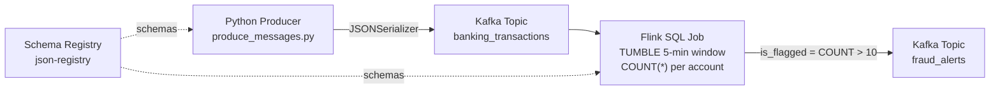

# Banking Fraud Detection — Real-Time Streaming System

A production-ready real-time fraud detection pipeline built on **Confluent Cloud**
(Kafka + Apache Flink) with **Terraform** Infrastructure-as-Code.

Banking transactions are streamed through Kafka, processed by a continuous Flink
SQL job that counts transactions per account in 5-minute tumbling windows, and
any account exceeding **10 transactions per 5-minute window** is flagged as a
fraud alert.

---

## Architecture



**Data flow:**
1. Python producer serialises transactions with Schema Registry JSON format
2. `banking_transactions` Kafka topic holds raw events (key = `account_id`)
3. Flink reads the topic, groups by `account_id` in 5-minute tumbling windows
4. Results land in `fraud_alerts` with `is_flagged = true` when count > 10
5. Downstream systems (not included) can consume `fraud_alerts` for action

---

## Quick Start

```bash
# 1. Deploy infrastructure
cd terraform
cp terraform.tfvars.example terraform.tfvars   # fill in credentials
terraform init && terraform apply

# 2. Set up Python
cd ../python
python3 -m venv .venv && source .venv/bin/activate
pip install -r requirements.txt

# 3. Generate window-aligned test data
python generate_sample_data.py

# 4. Stream transactions
python produce_messages.py
```

Full instructions → [`SETUP.md`](SETUP.md)

---

## Repository Structure

```
.
├── terraform/
│   ├── providers.tf              # Confluent + time + local providers
│   ├── variables.tf              # Input variables with defaults
│   ├── terraform.tfvars.example  # Template (copy → terraform.tfvars)
│   ├── main.tf                   # All Confluent resources + Flink SQL
│   └── outputs.tf                # Endpoints, keys, .env generation
├── python/
│   ├── requirements.txt          # Python dependencies
│   ├── .env.example              # Connection template
│   ├── generate_sample_data.py   # Window-aligned timestamp generator
│   ├── produce_messages.py       # Schema Registry producer
│   └── sample-transactions-template.json
├── SETUP.md                      # Step-by-step deployment guide
├── README.md                     # This file
└── TESTING-APPROACH.md           # Flink SQL verification queries
```

---

## Kafka Topics

| Topic | Key | Partitions | Purpose |
|-------|-----|------------|---------|
| `banking_transactions` | `account_id` | 4 | Raw inbound events |
| `fraud_alerts` | `account_id + window_start` | auto | Aggregated per-window results |

## Flink SQL Statements

| Statement | Type | Description |
|-----------|------|-------------|
| `create_banking_transactions` | DDL | Source table with 10 s watermark |
| `create_fraud_alerts` | DDL | Destination table (upsert semantics) |
| `fraud_detection_job` | DML | Continuous 5-minute tumbling window aggregation |

---

## Fraud Detection Logic

```sql
INSERT INTO fraud_alerts
SELECT
  account_id,
  window_start,
  window_end,
  COUNT(*)     AS transaction_count,
  SUM(amount)  AS total_amount,
  COUNT(*) > 10 AS is_flagged
FROM TABLE(
  TUMBLE(TABLE banking_transactions, DESCRIPTOR(transaction_time), INTERVAL '5' MINUTES)
)
GROUP BY account_id, window_start, window_end;
```

An account is flagged (`is_flagged = true`) when it produces **more than 10
transactions within any 5-minute window**. The `total_amount` field provides
additional context for downstream triage.

---

## Sample Test Accounts

| Account | Transactions / Window | Expected Result |
|---------|-----------------------|-----------------|
| `ACC-001-SUSPECT` | 12 | 🚨 `is_flagged = true` |
| `ACC-002-NORMAL` | 3 | ✅ `is_flagged = false` |
| `ACC-003-BORDERLINE` | 10 | ✅ `is_flagged = false` (threshold is >10, not ≥10) |

---

## Infrastructure

All resources provisioned by Terraform:

- **Confluent Cloud Environment** (ESSENTIALS governance tier)
- **Kafka Cluster** — Basic, single-zone
- **Schema Registry** — Auto-provisioned with environment
- **Flink Compute Pool** — max 5 CFUs (configurable)
- **Service Account** with three role bindings:
  - `CloudClusterAdmin` → Kafka cluster
  - `FlinkDeveloper` → Environment
  - `EnvironmentAdmin` → Environment
- **API Keys** — Kafka producer, Schema Registry, Flink (each correctly scoped)

---

## Testing

See [`TESTING-APPROACH.md`](TESTING-APPROACH.md) for four Flink SQL verification
queries with expected output and pass/fail criteria.
